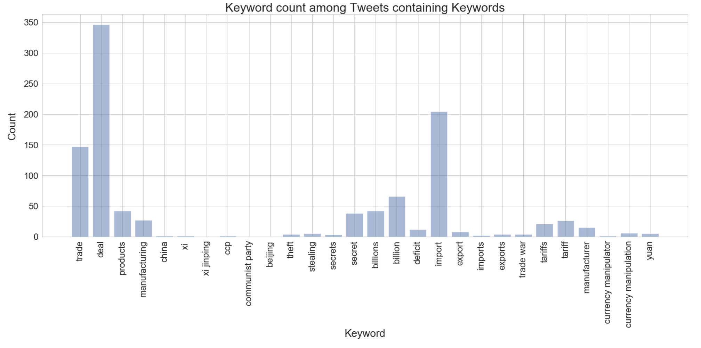

# Data Exploration
{: .no_toc }

## Table of contents
{: .no_toc .text-delta }

1. TOC
{:toc}

---

<!-- 
<style>
blockquote { background: #AEDE94; }
h1 { 
    padding-top: 25px;
    padding-bottom: 25px;
    text-align: left; 
    padding-left: 10px;
    background-color: #DDDDDD; 
    color: black;
}
h2 { 
    padding-top: 10px;
    padding-bottom: 10px;
    text-align: left; 
    padding-left: 5px;
    background-color: #EEEEEE; 
    color: black;
}

div.exercise {
	background-color: #ffcccc;
	border-color: #E9967A; 	
	border-left: 5px solid #800080; 
	padding: 0.5em;
}
div.theme {
	background-color: #DDDDDD;
	border-color: #E9967A; 	
	border-left: 5px solid #800080; 
	padding: 0.5em;
	font-size: 18pt;
}
div.gc { 
	background-color: #AEDE94;
	border-color: #E9967A; 	 
	border-left: 5px solid #800080; 
	padding: 0.5em;
	font-size: 12pt;
}
p.q1 { 
    padding-top: 5px;
    padding-bottom: 5px;
    text-align: left; 
    padding-left: 5px;
    background-color: #EEEEEE; 
    color: black;
}
header {
   padding-top: 35px;
    padding-bottom: 35px;
    text-align: left; 
    padding-left: 10px;
    background-color: #DDDDDD; 
    color: black;
}
</style>
 -->


# Data Collection and Cleaning


## Twitter
We pulled all of Trump's tweets in the last few years from his Twitter archive. Due to the naature of the database, we spent much time cleaning this data for our purposes. We took the following steps to clean the data:
+ Importing raw data from the archive
+ Removing unnecessary columns
+ Adjusting GMT to Eastern Time + accounting for daylight savings
+ Manually fixing errors in cells where the delimiting was incorrectly done in the database output and manually re-inserting the delimiting character
	
<p>First, we removed all Twitter data preceding June 1, 2016. Trump became the presumptive nominee of the Republican Party that summer, and we figured that this represented the beginning of Trump tweets’ meaningful market relevance. 
	There remained numerous instances of tweet data from the database lumping together multiple tweets in a single entry. We noticed that when this occurred, the components of these tweets were delimited by the character “{“. We used Excel’s “find” function to filter for all such cases. We then transferred all these “mega-cells” into a separate Excel sheet, which automatically separated the subcomponents of the tweet data: each row represented the data, including the actual tweet string, for a given tweet. However, the various classes of data (e.g., text, id_str, date, etc.) were lumped together in one column. These were split  using the aforementioned delimiter. We appended these cleaned data into the original Excel sheet, and then sorted the entire sheet by date to complete the process.
	Additionally, tweets that were subject to the above issue—and many others, in general—also misclassified retweets as Trump’s original tweets. Retweets started with ‘@[handle] : ‘ so I wrote a function to filter through the data for entries starting with ‘@‘ that also included a ‘:’. Not all such instances were retweets—some were just tweets by Trump—and so this process had a manual component too.</p>
	
We utilized `ntlk`'s `textblob` function in order to analyze the sentiment of tweets in our data set. For each tweet, this function created a polarity score (the more positive a tweet is, the closer the score is to 1; the more negative, the closer it is to -1). The function also returns a subjectivity score. Lower subjectivity score means that the tweet's polarity score more objectively represents its sentiment.

## VIX
VIX is the first benchmark index to measure expectations of future market volatility 
	(based on S&P 500 options). Since Milestone 2, we have procured minute-by-minute VIX data from 12/2015 - 11/11/2019. 
	This data includes only VIX pricing on trading days throughout the past few years (excludes holidays, weekends, etc.). 
	We manually pulled the data from a Bloomberg Terminal at HBS Baker Library. Given the size of the dataset and the Terminal download limits, we manually copied and pasted the VIX data directly into a csv file. Note that all other sources of VIX data are at best day-by-day and typically cost a nontrivial amount.

VIX is managed by CBOE (Chicago Board Options Exchange). The global trading hours for VIX can be found [here]("https://www.cboe.com/micro/eth/pdf/global-trading-hours.pdf"). Trading hours range from 3:15 am EST until 4:15 pm EST. There is a break bewteen 9:15 and 9:30 am, but this is addressed in how we consolidate our data.

## Consolidated Data
In order to consolidate the data, we merge our Twitter and VIX dataframes on date/time to ensure that we are only looking
	at tweets that are posted during VIX trading hours. That way, we do not have to worry about tweets occurring outside
	these hours. Also, when we look at the change in VIX price, we are only looking at changes during trading hours, so
	examining only tweets that are posted during trading hours allows us to perform this analysis soundly.

```python
from textblob import TextBlob
tweets = twitter_archive_df['text']
tweets_list = [tweet for tweet in tweets]
big_tweet_string = ' '.join(tweets_list)

tokens = word_tokenize(big_tweet_string)
words = [word.lower() for word in tokens if word.isalpha()]

stop_words = set(stopwords.words('english'))
words = [word for word in words if not word in stop_words]

scores = []
subjectivity = []
for tweet in tweets_list:
    blob_tweet = TextBlob(tweet)
    sentiment = blob_tweet.sentiment
    score = sentiment[0]
    subject = sentiment[1]
    
    scores.append(float(score))
    subjectivity.append(float(subject))

twitter_archive_df['sent_score'] = scores
twitter_archive_df['subjectivity'] = subjectivity
# twitter_archive_df.head()
```


<hr style="height:2pt">

# Data Description
Our data includes the following features:
- `is_retweet`: This variable describes whether a given tweet is a retweet or not. We re-coded the boolean from the database as a binary value, with is_retweet = 1 representing a tweet that Trump retweeted, while zero denotes a Trump tweet. This variable is important because we might expect Trump's own tweets to have a greater market impact than his retweets.

- `24_hr_perc`, `7_day_perc`, `14_day_perc`, `30_day_perc`: These variables describe the change in the value of VIX over the preceding 24hrs, 7 days, 14 days and 30 days. The intuition behind including this is that the direction and strength of volatility's momentum could well be tied to the market impact of a tweet. If, for instance, volatility has dropped because the market has become somewhat complacent about trade-related risks (i.e., the percentage change in VIX is negative), then a Trump tweet voicing dissatisfaction about the progress of a trade deal would cause a much larger spike in volatility than if markets had already "priced in" the possibility of antagonistic chatter from Trump.

- `minutes`: This variable is the minute in the day that the tweet was made. There is research that shows the majority of trading is done near the market's opening and close. From this follows that we may expect tweet's made around this time to have greater predictive impact than those made during the market's slower hours.

- `hour_0 to hour_23`: These are dummy variables for the hour in the day that the tweet was made. The intuition for this is similar to that for 'minutes'; perhaps the former is too granular, in which case the hour dummies might have more meaningful predictivity.

- `month_1 to month_12`: These are dummy variables for the month in which the tweet was posted, with month_1 representing January. Perhaps some months are more susceptible to market volatility, perhaps due to increased trading volumes or perhaps because those months are heavy with corporate earnings. That would potentially magnify the impact of tweets made in those months.

- `year`: This is the year in which the tweet was posted (after escalation of trade war, after inaugration). This would be a proxy for tweets made, say, before and after the escalation of trade war, or before and after the inaugration. We would expect that the impact of Trump tweets would vary depending on the circumstances of the particular year.

- `keywords (contained in all_keywords)`: These are all words that could be associated with the US-China trade war. By creating a column for each keyword, we turn each one into a predictor, allowing us to assess the impact on the VIX index of the presence of that particular keyword. Each row in a given column notes the number of times that particular keyword is used in that tweet. This has been coded to be case-insensitive--important given Trump's occasionally unconventional capitalization pracatices. The usage of one of these trade-related keywords could make a Trump tweet particularly meaningful to the market.

- `keyword_mentions`: This is the total number of non-unique keyword mentions in a given tweet. That is to say, if 'trade' is mentioned 2 time, 'China' 3 times and 'deficit' 1 time, then keyword_mentions=6. We think it is plausible that increased used of keywords would be associated with a tweet that contains more substance on a potentially market-moving matter.

- `handle_mentions`: This is the number of other Twitter users mentioned in the tweet, as measured by the number of '@' mentions in the tweet string. A potential issue with this would be extraneous uses of the character '@' or the mentioning of email addresses. We can assume that neither problem would occur much in the dataset. Tweets that mention multiple other users are perhaps less likely dealing with macroeconomic issues--maybe they're related to personal interactions--so this predictor might be negatively related to market impact.

- `exclamations`: This variable measures the number of exclamation marks used in each tweet string. This could have predictive impact on the VIX because Trump's use of emphasis on a tweet regarding, say, how China is "ripping off" America, might indicate to the market a greater leaning toward anti-China trade policies. 

- `links`: This is the number of links in a Trump tweet, as measured by occurrences of the 'http' string. This may not have the most market importance, but it's possible that the presence of links suggests that Trump is making some kind of comment with reference a particular news story or article, as opposed to making a pronouncement on a general issue of policy--implying reduced market impact.

- `tweet_len`: This is the length of a tweet. The logic underpinning the inclusion of this predictor is that longer tweets are likelier to be more substantive, and more substantive tweets are likelier to have an impact on the market.

# Exploratory Data Analysis

We did an initial analysis of some keywords, as shown in our notebook. The list is `['trade', 'Trade', 'deal', 'products', 'manufacturing', 'China', 'Xi', 'Xi Jinping', 'CCP', 'Communist Party', 'Beijing']`. Approximately 1/10 of Trump’s tweets that we cleaned (of ~14,000 total) contain some combination of these keywords. As we see above, the majority of the 'keywords' (based on our initial keyword list) appearing in our data are trade, Trade, deal, China, and Xi (products and manufacturing not far behind). CCP, Communist Party, and Beijing do not show up that frequently. In the future, we will probably employ functionality to search for the most frequently appearing useful words (excludes articles, punctuation, etc.). The histogram is reproduced below:

<div class="output_png output_subarea ">

</div>	

<p>The goal of looking at this list of keywords is to hone in on the content of Trump's tweets, specifically words and tweets in which we utilizes a negative tone toward China, and use tweet characteristics related to these keywords as relevant predictors in our model (such as how many of these keywords appear in a given tweet).</p>

<p>Now, we look at the distribution of sentiment and subjectivity scores for our Twitter data.</p>	

<div class="output_png output_subarea ">

</div>

<div class="output_png output_subarea ">

</div>

<p>We see that most of the tweets, as classified by textblob, are mainly neutral and leaning positive if anything. Then, in terms of subjectivity, we see that the distribution is almost normal with a great chunk of tweets being objectively classified based on sentiment score. Below, we will create a sentiment score variable that is weighted by (1-subjectivity) to capture 'objective' sentiment score.</p>

Next, we examine the VIX data. Below are summary statistics for the data we were able to pull and consolidate from 
	Bloomberg.


<div class="output_html rendered_html output_subarea output_execute_result">
<div>
<style scoped>
    .dataframe tbody tr th:only-of-type {
        vertical-align: middle;
    }

    .dataframe tbody tr th {
        vertical-align: top;
    }

    .dataframe thead th {
        text-align: right;
    }
</style>
<table border="1" class="dataframe">
  <thead>
    <tr style="text-align: right;">
      <th></th>
      <th>Last Price</th>
      <th>price_delta</th>
      <th>price_delta_5</th>
      <th>24_hr_perc</th>
      <th>7_day_perc</th>
      <th>14_day_perc</th>
      <th>30_day_perc</th>
      <th>52_week_high</th>
      <th>52_week_perc</th>
      <th>vix_delta_sign</th>
      <th>year</th>
      <th>month</th>
      <th>hour</th>
      <th>minutes</th>
    </tr>
  </thead>
  <tbody>
    <tr>
      <th>count</th>
      <td>722237.000000</td>
      <td>722237.000000</td>
      <td>722237.000000</td>
      <td>721833.000000</td>
      <td>719409.000000</td>
      <td>716581.000000</td>
      <td>710294.000000</td>
      <td>676514.000000</td>
      <td>676514.000000</td>
      <td>722236.000000</td>
      <td>722237.000000</td>
      <td>722237.000000</td>
      <td>722237.000000</td>
      <td>722237.00000</td>
    </tr>
    <tr>
      <th>mean</th>
      <td>14.738460</td>
      <td>-0.000022</td>
      <td>-0.000087</td>
      <td>0.001939</td>
      <td>0.010396</td>
      <td>0.016207</td>
      <td>0.022988</td>
      <td>38.205824</td>
      <td>0.399478</td>
      <td>0.000267</td>
      <td>2017.472323</td>
      <td>6.566354</td>
      <td>9.413017</td>
      <td>594.44071</td>
    </tr>
    <tr>
      <th>std</th>
      <td>4.103039</td>
      <td>0.062353</td>
      <td>0.125227</td>
      <td>0.067065</td>
      <td>0.163789</td>
      <td>0.218262</td>
      <td>0.275639</td>
      <td>11.517582</td>
      <td>0.103463</td>
      <td>0.355108</td>
      <td>1.113672</td>
      <td>3.335537</td>
      <td>3.796773</td>
      <td>226.93971</td>
    </tr>
    <tr>
      <th>min</th>
      <td>8.910000</td>
      <td>-12.690000</td>
      <td>-12.730000</td>
      <td>-0.430000</td>
      <td>-0.560000</td>
      <td>-0.610000</td>
      <td>-0.610000</td>
      <td>17.280000</td>
      <td>0.210000</td>
      <td>-1.000000</td>
      <td>2015.000000</td>
      <td>1.000000</td>
      <td>3.000000</td>
      <td>195.00000</td>
    </tr>
    <tr>
      <th>25%</th>
      <td>11.910000</td>
      <td>-0.010000</td>
      <td>-0.030000</td>
      <td>-0.030000</td>
      <td>-0.080000</td>
      <td>-0.100000</td>
      <td>-0.130000</td>
      <td>26.720000</td>
      <td>0.330000</td>
      <td>0.000000</td>
      <td>2017.000000</td>
      <td>4.000000</td>
      <td>6.000000</td>
      <td>395.00000</td>
    </tr>
    <tr>
      <th>50%</th>
      <td>13.680000</td>
      <td>0.000000</td>
      <td>0.000000</td>
      <td>0.000000</td>
      <td>-0.010000</td>
      <td>-0.020000</td>
      <td>-0.020000</td>
      <td>36.200000</td>
      <td>0.400000</td>
      <td>0.000000</td>
      <td>2017.000000</td>
      <td>7.000000</td>
      <td>10.000000</td>
      <td>610.00000</td>
    </tr>
    <tr>
      <th>75%</th>
      <td>16.580000</td>
      <td>0.010000</td>
      <td>0.030000</td>
      <td>0.030000</td>
      <td>0.070000</td>
      <td>0.090000</td>
      <td>0.110000</td>
      <td>50.300000</td>
      <td>0.450000</td>
      <td>0.000000</td>
      <td>2018.000000</td>
      <td>9.000000</td>
      <td>13.000000</td>
      <td>791.00000</td>
    </tr>
    <tr>
      <th>max</th>
      <td>50.200000</td>
      <td>8.570000</td>
      <td>8.520000</td>
      <td>1.490000</td>
      <td>2.570000</td>
      <td>3.320000</td>
      <td>3.920000</td>
      <td>53.290000</td>
      <td>1.000000</td>
      <td>1.000000</td>
      <td>2019.000000</td>
      <td>12.000000</td>
      <td>16.000000</td>
      <td>974.00000</td>
    </tr>
  </tbody>
</table>
</div>
</div>

<p>Just based on the above, we can see a pretty large range in the values of the VIX, 
	suggesting that the pricing jumps around a lot. At the same time, though, we see that on a minute by minute basis,
	the price change is very small. We keep this in mind when developing our models because even though are outcome is price
	delta, we experiment with different time intervals over which that delta is calculated to see which model will be most 
	useful. </p>
	  
<p>Additionally, in our EDA, we looked at a snippet of the VIX pricing data. Our thought process was before diving into 
	any analysis, we should first determine when the VIX rose or fell significantly and see if those changes appear 
	to be related to any significant news events around those times. Our initial graph of the VIX data looks at EOD VIX 
	pricing over a set period of time (December 1, 2015 - December 1, 2016). (Our analysis will hone in on minute by 
	minute, but for us, it is important to be aware of the major surges). This graph is not reproduced below because of 
	its size, but it can be seen in the notebook (title: “VIX Pricing over time”). The following were the main surges 
	during this time period:</p>
	
<ul>
	<li>12/11/15</li>
	<li>1/19/16</li>
	<li>2/11/16</li>
	<li>6/14/16</li> 
	<li>6/27/16</li>
	<li>9/12/16</li>
	<li>Two weeks before 2016 Presidential elections and a week afterwards</li>
</ul>
	
<p>For each date, we cross referenced it with the Financial Times Archives for the few days before and a few days after. 
Note: VIX is incredibly volatile, where for most metrics/indices a 3-4% change on any given day is regarded as a big move, 
such changes are the norm for VIX. Thus explaining any major surge due to one event remains challenging, yet for a high 
level understanding, we believe it to be necessary.</p>

<ul>
	<li>Oil Prices Reaching Seven Year Lows</li>
	<li>Wall St. makes worst start to year, global bearishness, oil resumes slide, Fed might raise interest rates again</li>
	<li>Very mixed news, articles suggest renewed China risks due to China’s unruly peer-to-peer lending — 21 people arrested involved in “a complete Ponzi scheme” — ballooned in size last year as credit-starved private companies paid swingeing interest rates to secure loans </li>
	<li>Weak jobs data, major uncertainty regarding Fed hiking interest rates</li> 
	<li>Post-Brexit jitters</li>
	<li>Oil price hikes, Merkel loses major state election in response to her open-door refugee policy</li>
	<li>Three major moves: first, as polling data shows narrowing of Clinton’s lead, the VIX continuously climbs, one of its more significant spikes being the day Fed reopened the investigation into her emails, secondly, one of VIX’s more significant downturns (though, still mild relative to the climbs of the previous weeks) was when the investigation was officially closed, and thirdly when Trump won, the VIX surged upwards, only to calm the day after when trading resumed, which was the exact trend following the Brexit vote. </li>
</ul>

<p>Note that the moves above are not directly related to Trump's tweets, but they did give us a sense for how striking news could affect VIX pricing on a minute by minute basis.</p>

<p></p>


