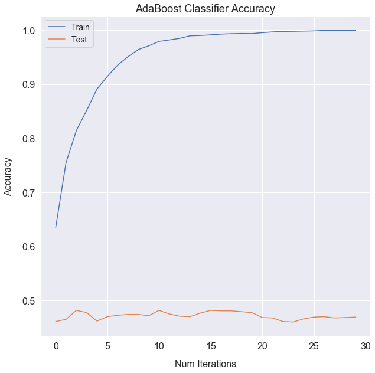
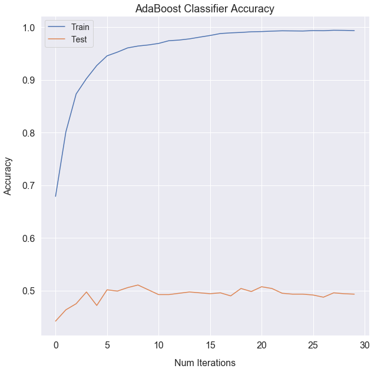
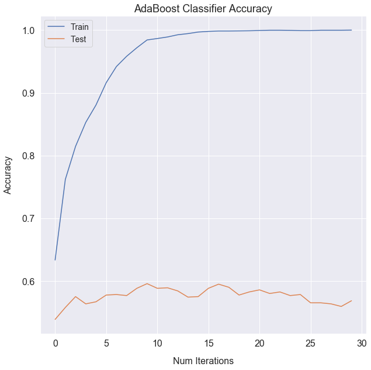
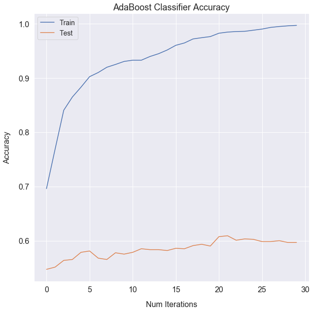
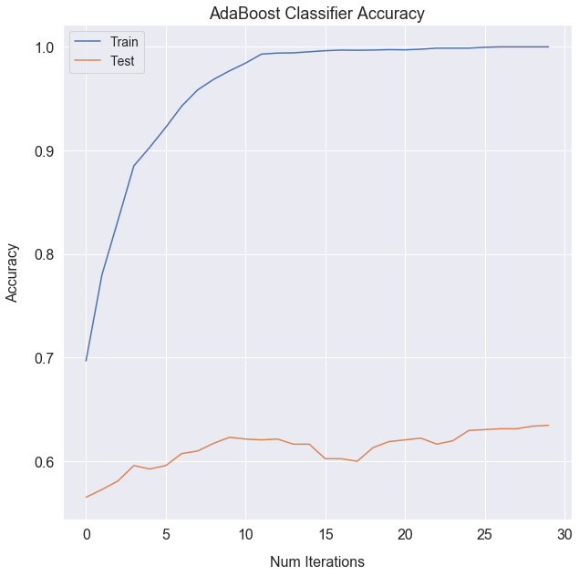
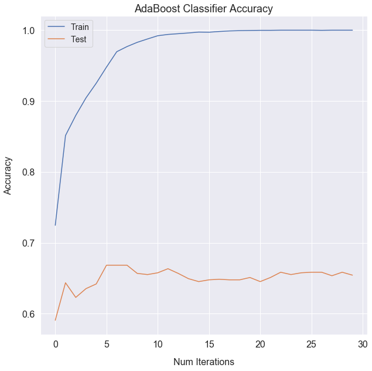

# Models
{: .no_toc }

## Table of contents
{: .no_toc .text-delta }

1. TOC
{:toc}

---

# Setup

<p>Our goal for this project is to build a model that can accurately predict changes in VIX prices after Trump tweets. In the model, we use characteristics of the VIX data (like <code class="highlighter-rouge">Last Price</code>) and multiple characteristics of the Twitter data. Also, some predictors are common to both datasets, such as date/time predictors.</p>
          
<p>Based on these predictors, we initially considered two types of models. First, we considered one that predicts absolute price changes in VIX pricing (continuous outcome). Second, we considered one that predicts the sign of VIX pricing changes (positive, negative, or no change - a categorical outcome). Intuitively, given what we know about the VIX and its pricing fluctuations, we thought it made more sense to focus on a model that predicts the change in pricing. Thus, we built a model that has a categorical output variable: -1 for negative price delta, 0 for no price delta, 1 for positive price delta.</p>
  
<p>We also wanted to create interval versions of this model that looks at the VIX price change over 1 minute, 5, 10, 20 , 30, and 60 minutes. We wanted to consider all these options to determine the most accurate and most useful model. Realistically, if our model predicts well 10+ minutes after the tweet, it can offer a great chance to earn positive returns by trading on the VIX index. Another important consideration is the threshold at which we declare an outcome positive or negative. Given we are using minute-by-minute data, we decided upon a 0.001 threshold so that any change between -0.001 and 0.001 inclusive should be categorized as 0 (no price delta). To explain why we chose 0.001, there are a couple points to consider. First, any change is very helpful in terms of playing the market through trading, even if it is a small change. Second, a larger threshold could have potentially forced our models to disproportionately predict 0 change (at all time intervals), which would not be a useful model. As we will see below, at larger intervals, our models predict far fewer 0 outcomes, becoming more successful at predicting positive or negative changes in the VIX pricing over time.</p>  

For each model trial, we first split our data into a train and test set, so that we are later able to assess how well our model performs in both a train set and a not-seen test set. Realistically, training accuracy reflects how well a given model 'understands' the data it is presented with, and testing accuracy reflects how well that model can be generalized to accurately form predictions about data it has not yet seen. For each time interval model, we drop the irrelevant time-based price predictors. For example, model30 does not include `price_delta_30` or `price_delta_60` as predictors. We perform this drop for each time interval model.
     
# Baseline Model - Logistic

<p>Our baseline model represents a simple logistic regression with a multiclass outcome variable. Using the predictors in our data, the model predicts the 'change in VIX price' classification as positive, negative, or 0 (no change) using a simple logistic regression.</p>          

```
# 1 min
logreg0 = LogisticRegression(C=10000).fit(X_train0, y_train0)
logreg_fit_train0 = logreg0.predict(X_train0)
logreg_fit_test0 = logreg0.predict(X_test0)

train_scores_logreg0 = accuracy_score(y_train0, logreg_fit_train0)
test_scores_logreg0 = accuracy_score(y_test0, logreg_fit_test0)

print("Training Accuracy 1 min: ", train_scores_logreg0)
print("Testing Accuracy 1 min: ", test_scores_logreg0)

# 5 min
logreg5 = LogisticRegression(C=10000).fit(X_train5, y_train5)
logreg_fit_train5 = logreg5.predict(X_train5)
logreg_fit_test5 = logreg5.predict(X_test5)

train_scores_logreg5 = accuracy_score(y_train5, logreg_fit_train5)
test_scores_logreg5 = accuracy_score(y_test5, logreg_fit_test5)

print("Training Accuracy 5 min: ", train_scores_logreg5)
print("Testing Accuracy 5 min: ", train_scores_logreg5)

# 10 min
logreg10 = LogisticRegression(C=10000).fit(X_train10, y_train10)
logreg_fit_train10 = logreg10.predict(X_train10)
logreg_fit_test10 = logreg10.predict(X_test10)

train_scores_logreg10 = accuracy_score(y_train10, logreg_fit_train10)
test_scores_logreg10 = accuracy_score(y_test10, logreg_fit_test10)

print("Training Accuracy 10 min: ", train_scores_logreg10)
print("Testing Accuracy 10 min: ", train_scores_logreg10)

# 20 min
logreg20 = LogisticRegression(C=10000).fit(X_train20, y_train20)
logreg_fit_train20 = logreg20.predict(X_train20)
logreg_fit_test20 = logreg20.predict(X_test20)

train_scores_logreg20 = accuracy_score(y_train20, logreg_fit_train20)
test_scores_logreg20 = accuracy_score(y_test20, logreg_fit_test20)

print("Training Accuracy 20 min: ", train_scores_logreg20)
print("Testing Accuracy 20 min: ", train_scores_logreg20)

# 30 min
logreg30 = LogisticRegression(C=10000).fit(X_train30, y_train30)
logreg_fit_train30 = logreg30.predict(X_train30)
logreg_fit_test30 = logreg30.predict(X_test30)

train_scores_logreg30 = accuracy_score(y_train30, logreg_fit_train30)
test_scores_logreg30 = accuracy_score(y_test30, logreg_fit_test30)

print("Training Accuracy 30 min: ", train_scores_logreg30)
print("Testing Accuracy 30 min: ", train_scores_logreg30)

# 60 min
logreg60 = LogisticRegression(C=10000).fit(X_train60, y_train60)
logreg_fit_train60 = logreg60.predict(X_train60)
logreg_fit_test60 = logreg60.predict(X_test60)

train_scores_logreg60 = accuracy_score(y_train60, logreg_fit_train60)
test_scores_logreg60 = accuracy_score(y_test60, logreg_fit_test60)

print("Training Accuracy 60 min: ", train_scores_logreg60)
print("Testing Accuracy 60 min: ", train_scores_logreg60)
```
```
Interval  training accuracy   test accuracy
30 minute	0.523760	          0.503306
20 minute	0.515702	          0.500826
60 minute	0.534946	          0.499586
10 minute	0.491529	          0.476033
5 minute	0.476033	          0.452893
1 minute	0.468182	          0.451240
```

# L1 and L2 Regularization

<p>We then decided to incorporate regularization in an attempt to improve our logistic model's predictive ability. Lasso regularization (L1) sets the effects/coefficients of unimportant predictors to 0, whereas ridge (L2) simply minimizes/lowers those effects.</p>               

<p>First, lasso regularization:</p>

```
from sklearn.linear_model import LogisticRegressionCV

# lasso
lasso = LogisticRegressionCV(cv=5, penalty='l1', max_iter=1000, solver='liblinear')

train_scores_logreg_lasso = []
test_scores_logreg_lasso = []

for i in range(len(X_train_list)):
    lassofit = lasso.fit(X_train_list[i], y_train_list[i])
    y_pred_train_lasso = lassofit.predict(X_train_list[i])
    y_pred_test_lasso = lassofit.predict(X_test_list[i])
    train_score = accuracy_score(y_train_list[i], y_pred_train_lasso)
    test_score = accuracy_score(y_test_list[i], y_pred_test_lasso)
    train_scores_logreg_lasso.append(train_score)
    test_scores_logreg_lasso.append(test_score)
    print(f'Training set accuracy score for {intervals[i]} using CV & LASSO penalty: {train_score:.4f}')
    print(f'Test set accuracy score for {intervals[i]} using CV & LASSO penalty: {test_score:.4f}')

```
```
Interval	training accuracy	test accuracy
1 minute	0.467769	          0.457025
5 minute	0.457025	          0.455372
60 minute	0.444582	          0.419355
30 minute	0.439669	          0.416529
20 minute	0.373140	          0.348760
10 minute	0.217149	          0.200826
```
<p>Now, ridge regularization:</p>
```
# ridge
ridge = LogisticRegressionCV(cv=5, penalty='l2', max_iter=1000, solver='liblinear')

train_scores_logreg_ridge = []
test_scores_logreg_ridge = []

for i in range(len(X_train_list)):
    ridgefit = ridge.fit(X_train_list[i], y_train_list[i])
    y_pred_train_ridge = ridgefit.predict(X_train_list[i])
    y_pred_test_ridge = ridgefit.predict(X_test_list[i])
    train_score = accuracy_score(y_train_list[i], y_pred_train_ridge)
    test_score = accuracy_score(y_test_list[i], y_pred_test_ridge)
    train_scores_logreg_ridge.append(train_score)
    test_scores_logreg_ridge.append(test_score)
    print(f'Training set accuracy score for {intervals[i]} using CV & Ridge penalty:: {train_score:.4f}')
    print(f'Test set accuracy score for {intervals[i]} using CV & Ridge penalty:: {test_score:.4f}')

```
```
Interval	training accuracy	test accuracy
60 minute	0.544458	          0.516129
20 minute	0.526033	          0.500826
30 minute	0.531612	          0.495868
10 minute	0.495455	          0.480165
1 minute	0.469421	          0.451240
5 minute	0.473140	          0.439669
```
# Random Forest

<p>Our first ensemble method is random forest, which randomly subsets predictors upon which to generate decision trees. We tested out a few different tree depth and number parameters ourselves and determined that a depth of 5 and number of trees of 100 was ideal for our analysis.</p>

<p>Below is sample code for one of the time interval models. We perform this for each of the models, and the results can bee seen below this code.</p>
```
# Calibrate num trees and tree depth (after having tried different parameters, saw comparable results)
n_trees = 100
tree_depth = 5
```

```
# create RF models
forest_model0 = RandomForestClassifier(n_estimators=n_trees, max_depth=tree_depth, 
                                      max_features=int(np.sqrt(len(np_X_train0[0]))))

forest_model5 = RandomForestClassifier(n_estimators=n_trees, max_depth=tree_depth, 
                                      max_features=int(np.sqrt(len(np_X_train5[0]))))

forest_model10 = RandomForestClassifier(n_estimators=n_trees, max_depth=tree_depth, 
                                      max_features=int(np.sqrt(len(np_X_train10[0]))))

forest_model20 = RandomForestClassifier(n_estimators=n_trees, max_depth=tree_depth, 
                                      max_features=int(np.sqrt(len(np_X_train20[0]))))

forest_model30 = RandomForestClassifier(n_estimators=n_trees, max_depth=tree_depth, 
                                      max_features=int(np.sqrt(len(np_X_train30[0]))))

forest_model60 = RandomForestClassifier(n_estimators=n_trees, max_depth=tree_depth, 
                                      max_features=int(np.sqrt(len(np_X_train60[0]))))
```

```
# fit and calculate accuracy
forest_model0.fit(np_X_train0, np_y_train0)
y_pred0_forest_train = forest_model0.predict(np_X_train0)
y_pred0_forest_test = forest_model0.predict(np_X_test0)

random_forest_train_score0 = accuracy_score(np_y_train0, y_pred0_forest_train)
random_forest_test_score0 = accuracy_score(np_y_test0, y_pred0_forest_test)
print(f'The random forest accuracy on the training set: {random_forest_train_score0}')
print(f'The random forest accuracy on the test set: {random_forest_test_score0:.4f}')

```

```
Interval	training accuracy	test accuracy
60 minute	0.620968	          0.545906
20 minute	0.623347	          0.532231
30 minute	0.611777	          0.514050
10 minute	0.635331	          0.508264
1 minute	0.547934	          0.455372
5 minute	0.591116	          0.446281
```


# Boosting
Next, we will consider boosting, an iterative approach that might eliminate some more of the error in our trees.

<p>Below is sample code for one of the time interval models. We perform this for each of the models, and the results can bee seen below this code.</p>

```python
# initialize parameters like for RF, much the same process - tested different ones and saw best/most consistent results with the following
estimators_ADA = 40
learning_ADA = 0.01
tree_depth = 10
```

```
model_ADA0 = AdaBoostClassifier(base_estimator=DecisionTreeClassifier(max_depth=tree_depth), 
                               learning_rate=learning_ADA, n_estimators=estimators_ADA)
model_ADA0.fit(np_X_train0, np_y_train0)

y_train_pred_ADA0 = model_ADA0.predict(np_X_train0)
y_test_pred_ADA0 = model_ADA0.predict(np_X_test0)
ADA_train0 = accuracy_score(np_y_train0, y_train_pred_ADA0)
ADA_test0 = accuracy_score(np_y_test0, y_test_pred_ADA0)
print(f'The ADABoost accuracy on the training set: {ADA_train0}')
print(f'The ADABoost accuracy on the test set: {ADA_test0:.4f}')

ADA_train0_staged = list(model_ADA0.staged_score(np_X_train0, np_y_train0))
ADA_test0_staged = list(model_ADA0.staged_score(np_X_test0, np_y_test0))
```

```
# define function to abstract process of building plot
def baselearner_plt(n, X_train, y_train, X_test, y_test):
    # AdaBoostClassifier
    ada = AdaBoostClassifier(DecisionTreeClassifier(max_depth=n), n_estimators=30, learning_rate = 0.05)
    ada.fit(X_train, y_train)
    
    # staged_score train to plot
    ada_predicts_train = list(ada.staged_score(X_train,y_train))
    plt.plot(ada_predicts_train, label = "Train");

    # staged_score test to plot
    ada_predicts_test = list(ada.staged_score(X_test,y_test))
    plt.plot(ada_predicts_test, label = "Test");

    plt.legend(fontsize=14)
    plt.title("AdaBoost Classifier Accuracy", fontsize=18)
    plt.ylabel("Accuracy", fontsize=16)
    plt.xlabel("Num Iterations", fontsize=16)
    plt.show()
    
    print("Maximum test accuracy for depth of "+str(n)+" is "+str(max(ada_predicts_test))+" at "+str(ada_predicts_test.index(max(ada_predicts_test)))+" iterations")

for i in range(len(X_train_list)):
    baselearner_plt(tree_depth, X_train_list[i], y_train_list[i], X_test_list[i], y_test_list[i])
    print("Time Interval: ", intervals[i]) 
    
```



    Maximum test accuracy for depth of 10 is 0.4818181818181818 at 2 iterations
    Time Interval:  1 minute





    Maximum test accuracy for depth of 10 is 0.5107438016528926 at 8 iterations
    Time Interval:  5 minute




    Maximum test accuracy for depth of 10 is 0.5958677685950413 at 9 iterations
    Time Interval:  10 minute




    Maximum test accuracy for depth of 10 is 0.6090909090909091 at 21 iterations
    Time Interval:  20 minute




    Maximum test accuracy for depth of 10 is 0.6347107438016529 at 29 iterations
    Time Interval:  30 minute




    Maximum test accuracy for depth of 10 is 0.6683209263854425 at 5 iterations
    Time Interval:  60 minute


# Neural Networks

Finally, we created an artificial neural network to classify the changes in VIX price. In this model, we shrunk the number of categories to 2, positive and negative, to see how well this baseline NN performs.

```
# prepare model
model = models.Sequential()
for i in range(5):
    model.add(tf.keras.layers.Dense(100, activation='relu'))
    model.add(layers.Dropout(0.3))
model.add(tf.keras.layers.Dense(1, activation='sigmoid'))
model.compile(loss='binary_crossentropy', optimizer='adam', metrics=['accuracy'])

# define parameters
epochs = 100
batch_size = 12
validation_split = 0.3

# fit model
history0 = model.fit(np_X_train0_NN, np_y_train0_NN, validation_split=validation_split, epochs=epochs, batch_size=batch_size, verbose=False)
history5 = model.fit(np_X_train5_NN, np_y_train5_NN, validation_split=validation_split, epochs=epochs, batch_size=batch_size, verbose=False)
history10 = model.fit(np_X_train10_NN, np_y_train10_NN, validation_split=validation_split, epochs=epochs, batch_size=batch_size, verbose=False)
history20 = model.fit(np_X_train20_NN, np_y_train20_NN, validation_split=validation_split, epochs=epochs, batch_size=batch_size, verbose=False)
history30 = model.fit(np_X_train30_NN, np_y_train30_NN, validation_split=validation_split, epochs=epochs, batch_size=batch_size, verbose=False)
history60 = model.fit(np_X_train60_NN, np_y_train60_NN, validation_split=validation_split, epochs=epochs, batch_size=batch_size, verbose=False)
```

```
# output relevant information
histories = [history0, history5, history10, history20, history30, history60]

for i, history in zip(range(len(intervals)), histories):
    kaggle_train_acc = history.history['accuracy'][-1]
    val_loss = history.history['val_loss'][-1]
    val_acc = history.history['val_accuracy'][-1]
    diff = val_acc - val_loss
    loss = history.history['loss'][-1]
    model.summary()
    print(f'{intervals[i]} \n ModelTraining Accuracy={kaggle_train_acc}, \n Training Loss={loss}, \n Model Validation Accuracy: {val_acc}, \n Model Validation Loss: {val_loss}, \n Difference between Validation Accuracy and Loss: {diff} \n')
```

Even after changing hyperparameters, our neural network does not perform very well. Using 40 layers and 300 epochs, the accuracy in the training data is still 62.8% while the accuracy in the test is 65.2%. This is baffling, because we expected our neural network to perform very well. Perhaps this mediocre perforance is due to limitations of our data set (only 14 features and <5000 songs), or of the specific methods we used.

---

# Model Selection

Based upon the presented analysis, we conclude that our boosted decision tree classifier, at a depth of 2 with 751 iterations, is the best model. It achieves the highest accuracy in the test set, of 93.0%.


