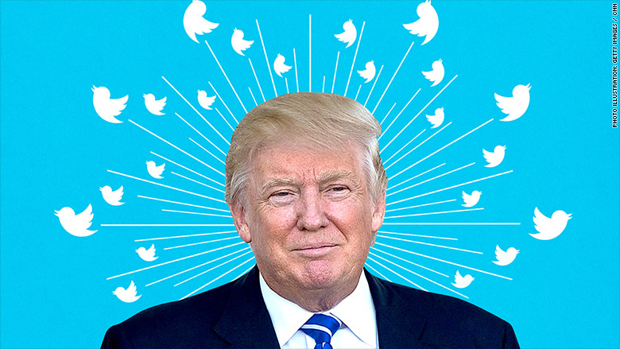

# Trump Tweet VIX (Group 3)
{: .no_toc }

## Table of contents
{: .no_toc .text-delta }

1. TOC
{:toc}

---

# Overview

For our final project, we wanted to build a model that uses President Trump's tweets to predict changes in the VIX Index. Theoretically, a model performing accurately 51 (or higher) percent of the time provides a way to intelligently bet on market volatility and generate a positive return on average. 

We utilized Trump's Twitter archive [here](http://www.trumptwitterarchive.com/archive) to build our database of tweets, and we pulled minute-by-minute VIX data from an HBS Baker Library Bloomberg Terminal. Our analysis begins in May 2016 when Trump emerged as a solid, leading candidate for the GOP in the 2016 Presidential election. 

  

Source: CNN

# Website Navigation
Our project background and question, as well as a brief literature review, can be found on the [background](background.html) page. 
Our data description and collection information, as well as our exploratory data analysis, can be found on the [data exploration](final_notebook/data.html) page.
Our final models can be found on the [models](final_notebook/models.html) page. 
Our results, analysis, conclusions, and final discussion can be found on the [conclusions](conclusions.html) page.

# About Us
We are Gaurang Goel, Yashvardhan Bardoloi, and Adil Bhatia, Group 3 in CS109A, Fall 2019. 
Special thanks to Robbert Struyven and James Zeitler for their assistance.

	
	
	
	

